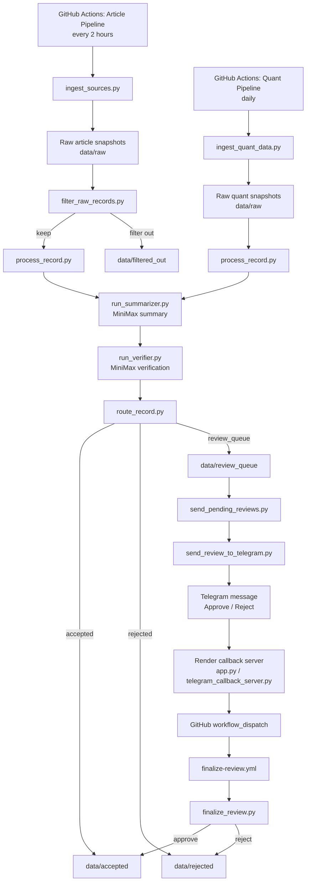
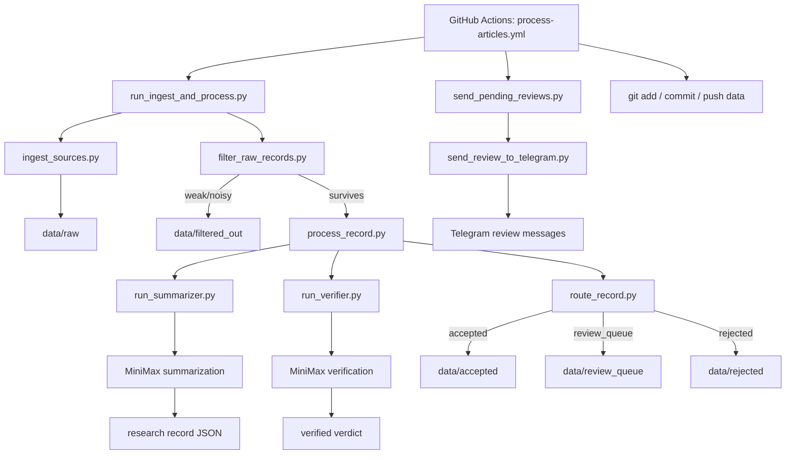
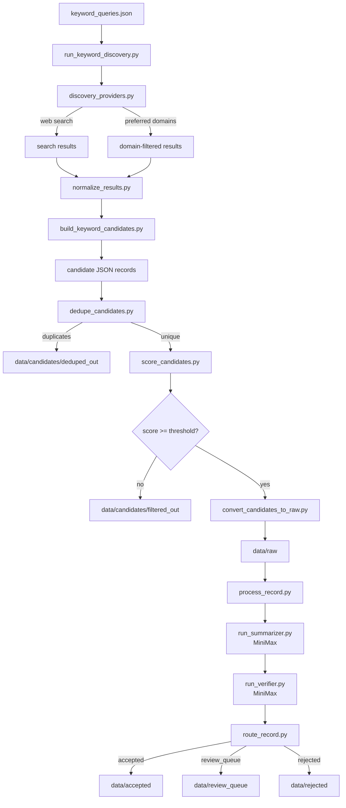
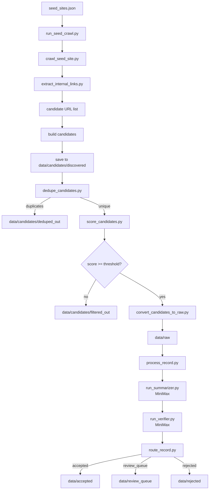
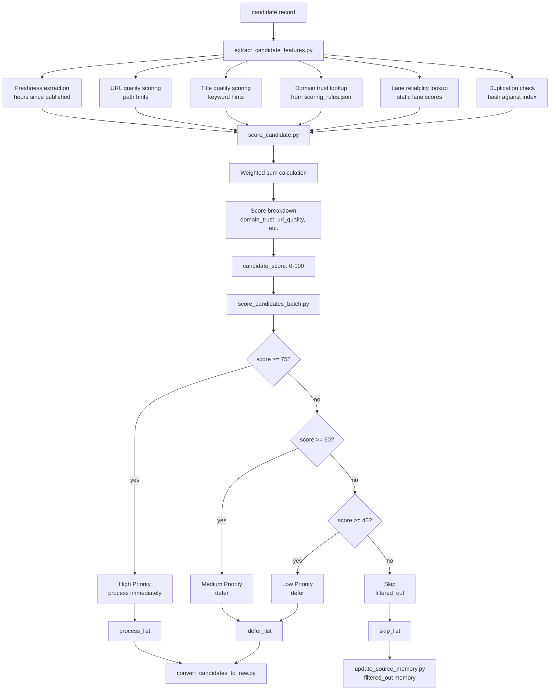
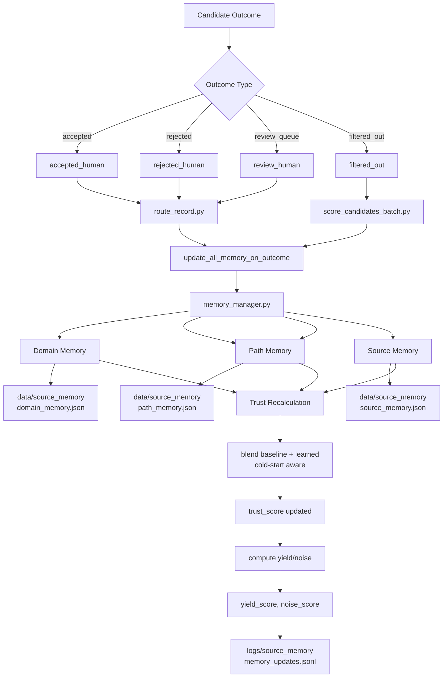
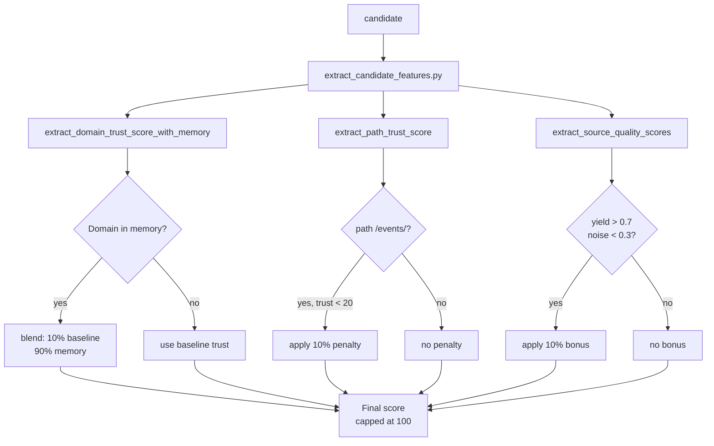
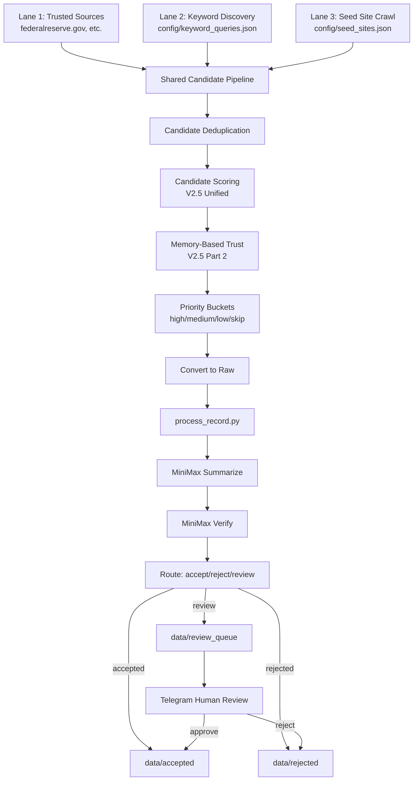

# Finance Research Archive

A quality-controlled finance research archive for future RAG, focused on **market structure**, **macro catalysts**, and an expanding mix of **article sources** and **quantitative data sources**.

This project is built to do more than collect links. It continuously ingests finance-relevant information, filters weak inputs, summarizes and verifies records with MiniMax, routes high-confidence records into an archive, and sends uncertain items to Telegram for human approval.

---

## What this repo does

This repo runs a multi-stage research pipeline:

- ingests **article-style sources** on a frequent schedule
- ingests **quantitative / numeric sources** on a slower schedule
- filters low-value or noisy inputs before spending model calls
- uses **MiniMax** to summarize and verify candidate records
- automatically routes records into:
  - `accepted`
  - `review_queue`
  - `rejected`
- sends `review_queue` items to **Telegram**
- lets a human approve or reject them from Telegram
- finalizes the record in GitHub through a callback-triggered workflow

The end goal is a clean, growing finance research archive that can later power:
- RAG
- dashboards
- eval sets
- finance copilots
- research digests

---

## Focus areas

This archive currently focuses on:

- **Market structure**
  - liquidity
  - repo / funding
  - Treasury issuance
  - auctions
  - yields
  - ETF / exchange / clearing / rulemaking context
- **Macro catalysts**
  - inflation
  - CPI / PPI
  - labor market
  - GDP / spending / growth
  - central bank policy
  - rates / policy path expectations

---

## High-level architecture

## Full system flow

---

# Workflow Architecture Appendix

This section explains the three main GitHub Actions workflows in the repo and visually shows how records move through the system.

   The repo currently has three main automation workflows:

    - **Article Research Pipeline**
    - **Quant Research Pipeline**
    - **Finalize Review Decision**

    Each one has a different job in the archive lifecycle.

---

## 1. Article Research Pipeline

**Workflow file:** `.github/workflows/process-articles.yml`

This workflow runs on:
- manual trigger
- schedule every 2 hours

At a high level it:

1. ingests article-style sources
2. filters weak/noisy raw records
3. processes each surviving record
4. sends any review-needed records to Telegram
5. commits resulting archive changes back to GitHub

This workflow calls:
- `scripts/run_ingest_and_process.py`
- `scripts/send_pending_reviews.py` :contentReference[oaicite:3]{index=3}

### What happens inside `run_ingest_and_process.py`

That script does:

1. `scripts/ingest_sources.py`
2. `scripts/filter_raw_records.py`
3. for each surviving record:
   - `scripts/process_record.py <record_id>`

Then `process_record.py` does:

1. `scripts/run_summarizer.py <record_id>`
2. `scripts/run_verifier.py <record_id>`
3. `scripts/route_record.py <record_id>` :contentReference[oaicite:4]{index=4}

### Where AI steps in

The AI steps are:

- **Summarization:** `run_summarizer.py`
  - reads raw source text
  - loads the summarize prompt + schema
  - calls MiniMax
  - writes the structured research record

- **Verification:** `run_verifier.py`
  - reads original source text + generated record
  - calls MiniMax again
  - decides whether the record should be accepted, reviewed, or rejected

So the article workflow uses MiniMax twice on each kept record:
- once to generate the research record
- once to verify the research record against the source :contentReference[oaicite:5]{index=5}

### Article pipeline diagram

---

## 2. Keyword Discovery Pipeline

**Script:** `scripts/run_keyword_discovery.py`

This lane discovers candidates through keyword searches against configured queries. It feeds into the shared candidate pipeline.

Flow:
1. Load `config/keyword_queries.json`
2. For each enabled query, execute search (web or preferred domains)
3. Normalize results and build candidates
4. Shared pipeline: dedupe → scoring → filtering → convert → process_record

### Keyword discovery diagram

---

## 3. Seed Site Crawling Pipeline

**Script:** `scripts/run_seed_crawl.py`

This lane crawls configured seed sites to discover candidates. It also feeds into the shared candidate pipeline.

Flow:
1. Load `config/seed_sites.json`
2. For each enabled seed, crawl and extract links
3. Build candidates from discovered URLs
4. Shared pipeline: dedupe → scoring → filtering → convert → process_record

### Seed crawl diagram

---

## 4. V2.5 Unified Scoring System

**Scripts:** 
- `scripts/extract_candidate_features.py`
- `scripts/score_candidate.py`
- `scripts/score_candidates_batch.py`

V2.5 introduced a unified scoring system with multiple weighted components and priority buckets.

### Scoring components

| Component | Weight | Description |
|-----------|--------|-------------|
| domain_trust | 0.25 | Trust from domain baselines (high=100, medium=50, low=10) |
| url_quality | 0.20 | URL structure hints (positive: press, report, research) |
| title_quality | 0.20 | Title keyword hints |
| keyword_match | 0.20 | Match against keyword bundles |
| freshness | 0.10 | Age decay (full score < 168 hours) |
| lane_reliability | 0.10 | Lane-based reliability (trusted=100, keyword=50, seed=30) |
| duplication_risk | -0.15 | Duplicate penalty (URL/title hash matches) |

### Scoring flow diagram

---

## 5. V2.5 Memory System

**Scripts:**
- `scripts/memory_persistence.py`
- `scripts/memory_manager.py`
- `scripts/update_source_memory.py`

Memory tracks domain, path-pattern, and source performance over time to make scoring adaptive.

### Memory types

| Memory Type | Tracks | Key Metrics |
|-------------|--------|-------------|
| Domain Memory | `data/source_memory/domain_memory.json` | trust_score, accepted/rejected counts, yield/noise |
| Path Memory | `data/source_memory/path_memory.json` | `/events/`, `/research/` pattern trust |
| Source Memory | `data/source_memory/source_memory.json` | source_id yield/noise, lane-based trust |

### Memory update flow

### Memory-influenced scoring

### Cold-start blending

New domains/sources start with baseline trust and gradually shift to learned trust:

| Samples | Baseline Weight | Learned Weight |
|---------|-----------------|----------------|
| 0-9 | 90-100% | 0-10% |
| 10-24 | 90% → 10% | 10% → 90% |
| 25+ | 10% | 90% |

Human decisions are weighted 2x more than automatic decisions.

---

## 6. Three-Lane Architecture

The system uses three discovery lanes that converge into a shared processing pipeline:

