# Finance Research Archive

A quality-controlled finance research archive for future RAG, focused on **market structure**, **macro catalysts**, and an expanding mix of **article sources** and **quantitative data sources**.

This project is built to do more than collect links. It continuously ingests finance-relevant information, filters weak inputs, summarizes and verifies records with MiniMax, routes high-confidence records into an archive, and sends uncertain items to Telegram for human approval.

---

## What this repo does

This repo runs a multi-stage research pipeline:

- ingests **article-style sources** on a frequent schedule (parallel HTTP fetch workers)
- ingests **SEC EDGAR filings** (8-K, 10-K, 10-Q) every 6 hours
- ingests **academic papers** from arXiv and SSRN
- ingests **quantitative / numeric sources** daily with real numeric change detection
- accepts **manual drops** via inbox folder (PDF/txt/html) and Telegram bot
- filters low-value or noisy inputs before spending model calls
- uses **MiniMax** to summarize and verify candidate records
- automatically routes records into `accepted`, `review_queue`, `rejected`
- sends `review_queue` items to **Telegram** for human approval
- finalizes human decisions through a callback-triggered workflow
- embeds accepted records into a **ChromaDB vector store** for RAG and semantic dedup
- runs a weekly **pipeline health dashboard** with auto-disable for stale sources

### V2.7 additions

The V2.7 layer adds intelligence on top of the base pipeline:

- **Triage & prioritization engine** — scores and routes candidates through priority buckets before processing
- **Event clustering & story graphs** — groups related records into market events with narrative + quant evidence
- **Watchlists & thesis tracking** — monitors specific topics and tracks thesis validity over time
- **Article-quant enrichment** — links narrative articles to quantitative records with deterministic scoring
- **Source performance analytics** — tracks per-source acceptance rates and generates actionable recommendations
- **Massive source expansion** — 108 additional curated sources across 7 families (central banks, regulators, exchanges, think tanks, etc.)

### V3 additions (Phases 1–10, all complete)

V3 fixes, stabilizes, and significantly extends the system:

- **Phase 1** — Fixed listing URL permanent-block bug, re-enabled RSS feeds, raised ingest caps, fixed keyword `days_back`
- **Phase 2** — LLM-generated ephemeral keyword queries from recent accepted records each run
- **Phase 3** — Replaced JSON manifests with a transactional SQLite database (`data/archive.db`)
- **Phase 4** — New SEC EDGAR pipeline: polls 8-K/10-K/10-Q filings for configured CIKs every 6 hours
- **Phase 5** — New academic papers pipeline: arXiv q-fin/econ papers ingested on every article run
- **Phase 6** — BIS, IMF, World Bank feeds activated; World Bank API quant series added
- **Phase 7** — Inbox file drop (PDF/txt/html) and Telegram bot for ad-hoc URL ingestion
- **Phase 8** — ChromaDB vector store, semantic dedup before summarization, local `search_archive.py`
- **Phase 9** — Weekly Markdown health dashboard, consecutive-empty-run auto-disable, Telegram health alert
- **Phase 10** — Parallel HTTP fetch workers (ThreadPoolExecutor + per-domain rate limiting); real TreasuryFiscalData and NY Fed quant fetchers; numeric data-date change detection replacing placeholders

The end goal is a clean, growing finance research archive that can later power:
- RAG
- dashboards
- eval sets
- finance copilots
- research digests

---

## Focus areas

This archive currently focuses on:

- **Market structure**
  - liquidity
  - repo / funding
  - Treasury issuance
  - auctions
  - yields
  - ETF / exchange / clearing / rulemaking context
- **Macro catalysts**
  - inflation
  - CPI / PPI
  - labor market
  - GDP / spending / growth
  - central bank policy
  - rates / policy path expectations

---

## High-level architecture

### Full system flow

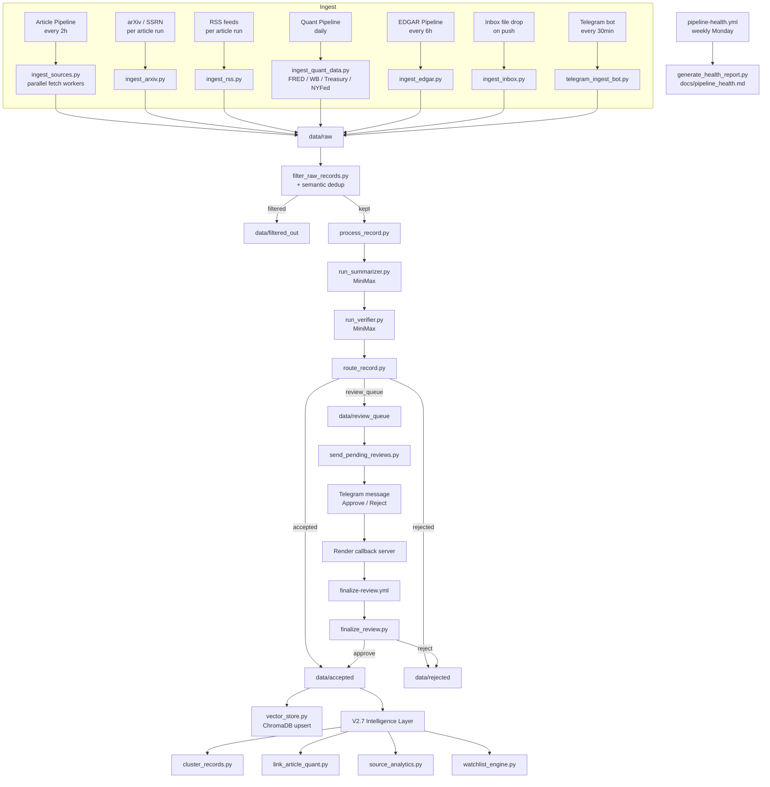

---

# Workflow Architecture

This section explains every active GitHub Actions workflow and how records move through the system.

## Active workflows

| Workflow | Schedule | Purpose |
|----------|----------|---------|
| `process-articles.yml` | Every 2 hours | Article + RSS + arXiv ingest, filter, summarize, review |
| `process-quant.yml` | Daily 13:15 UTC | FRED / World Bank / Treasury / NY Fed quant snapshots |
| `process-edgar.yml` | Every 6 hours | SEC EDGAR 8-K / 10-K / 10-Q filings |
| `process-keyword-discovery.yml` | Every 4 hours | Keyword-driven search discovery |
| `process-seed-crawl.yml` | Every 4 hours | Seed site link crawling |
| `process-backlog.yml` | Manual dispatch | Process pre-existing raw backlog |
| `process-inbox.yml` | On push to data/inbox | Parse dropped PDF/txt/html files |
| `process-telegram-inbox.yml` | Every 30 minutes | Drain Telegram bot URL queue |
| `pipeline-health.yml` | Monday 09:00 UTC | Weekly health report, Telegram summary |
| `finalize-review.yml` | Manual dispatch | Apply human approve/reject from Telegram |

---

## 1. Article Research Pipeline

**Workflow file:** `.github/workflows/process-articles.yml`

Runs every 2 hours. Ingests article sources, RSS, and arXiv papers; filters weak records; processes survivors through MiniMax summarize + verify + route; sends review items to Telegram.

### What happens inside `run_ingest_and_process.py`

```
ingest_sources.py   --fetch-workers 5   (parallel HTTP, per-domain rate limit)
ingest_rss.py
ingest_arxiv.py
filter_raw_records.py
  → for each surviving record:
      process_record.py
          run_summarizer.py  (MiniMax)
          run_verifier.py    (MiniMax)
          route_record.py
send_pending_reviews.py
```

### Article pipeline diagram

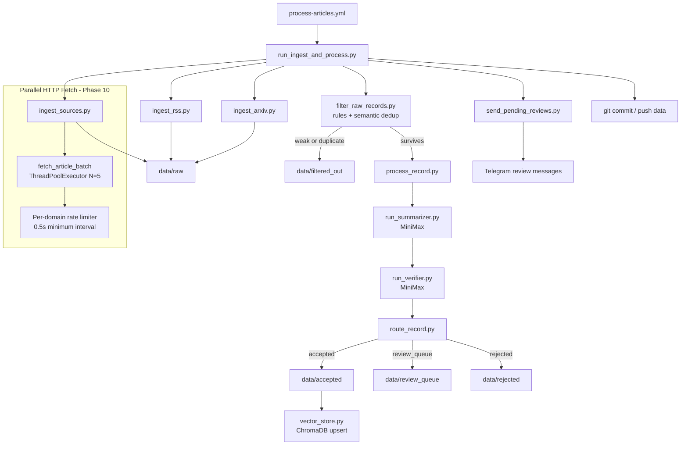

---

## 2. Quant Research Pipeline

**Workflow file:** `.github/workflows/process-quant.yml`

Runs daily. Fetches numeric data from FRED, World Bank, TreasuryFiscalData, and NY Fed. Uses **numeric date-comparison change detection** (Phase 10): a new record is only written when the fetched data point date is strictly newer than the most recently stored date for that series.

### Quant sources

| Source | Type | Secrets |
|--------|------|---------|
| FRED (SOFR, DFF, DGS2, DGS10, IORB) | `series` | `FRED_API_KEY` |
| World Bank (GDP growth, inflation, debt, trade) | `worldbank_series` | None |
| TreasuryFiscalData (auctions, upcoming auctions) | `datasets` | None |
| NY Fed (repo operations) | `datasets` | None |

### Quant pipeline diagram

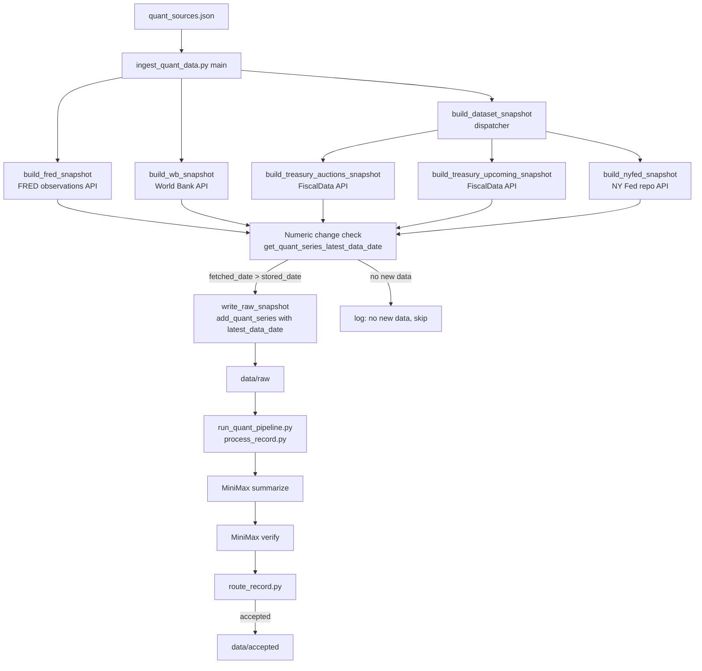

---

## 3. EDGAR Pipeline (Phase 4)

**Workflow file:** `.github/workflows/process-edgar.yml`

Runs every 6 hours. Polls EDGAR's full-text search for configured CIK numbers and filing types (8-K, 10-K, 10-Q). Dedupes by accession number using the SQLite manifest so the same filing is never processed twice.

### EDGAR pipeline diagram

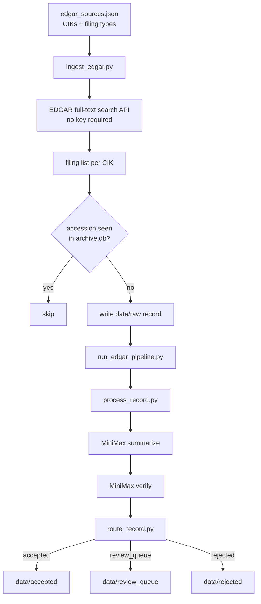

---

## 4. Academic Papers Pipeline (Phase 5)

**Script:** `scripts/ingest_arxiv.py` — called inside every article pipeline run.

Ingests q-fin and econ papers from arXiv. Each paper's abstract and metadata become a raw record that passes through the same summarize/verify/route chain. Academic sources receive a scoring bonus in `scoring_rules.json`.

### Academic pipeline diagram

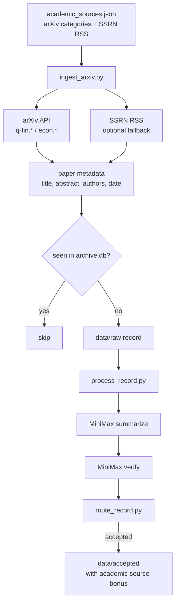

---

## 5. Inbox and Telegram Ingestion (Phase 7)

Two complementary manual-input channels that bypass scheduled crawls.

### Inbox file drop

Drop a PDF, `.txt`, `.html`, or `.md` file into `data/inbox/`. The `process-inbox.yml` workflow triggers on push and runs `ingest_inbox.py`, which parses the file and writes it as a standard raw record.

### Telegram ingestion bot

Send a URL (or paste text) to the Telegram ingest bot. `process-telegram-inbox.yml` runs every 30 minutes, polls the bot for new messages, queues URLs in `data/inbox_queue.json`, and the next article pipeline run drains that queue via `drain_inbox_queue()` in `run_ingest_and_process.py`.

### Ingestion channels diagram

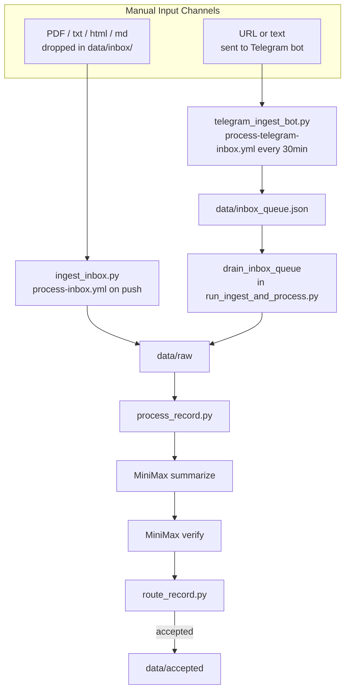

---

## 6. Vector Store and RAG Foundation (Phase 8)

**Scripts:** `scripts/vector_store.py`, `scripts/backfill_vector_store.py`, `scripts/search_archive.py`

Every accepted record is embedded and upserted into a ChromaDB collection at `data/vector_store/`. The same store is queried during `filter_raw_records.py` for **semantic deduplication** before the expensive MiniMax steps. `search_archive.py` provides a local CLI for querying the archive by meaning.

### Vector store diagram

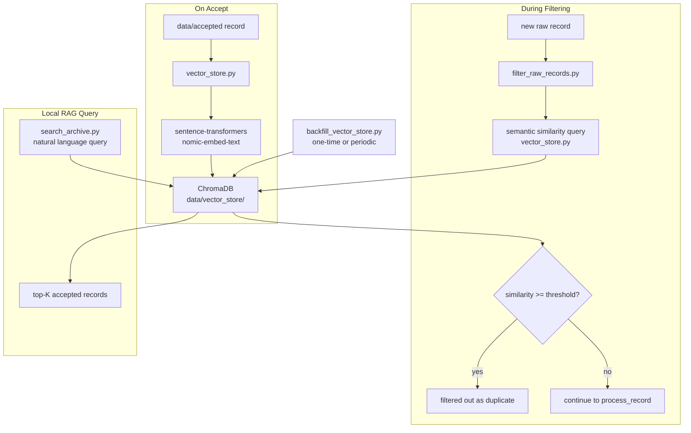

---

## 7. Pipeline Health Dashboard (Phase 9)

**Workflow file:** `.github/workflows/pipeline-health.yml` — runs every Monday at 09:00 UTC.

Generates `docs/pipeline_health.md` with 30-day per-source stats. Tracks `consecutive_empty_runs` in the `source_health` table of `archive.db`. Sources that exceed the `auto_disable_after` threshold in `config/health_config.json` are automatically flagged with `auto_disabled = 1` and skipped by ingest scripts until manually re-enabled.

### Health dashboard diagram

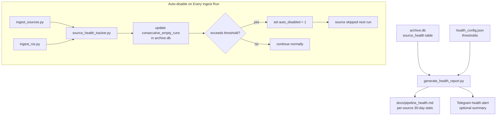

---

## 8. Three-Lane Discovery Architecture

Sources enter through three lanes that converge into the same processing pipeline:

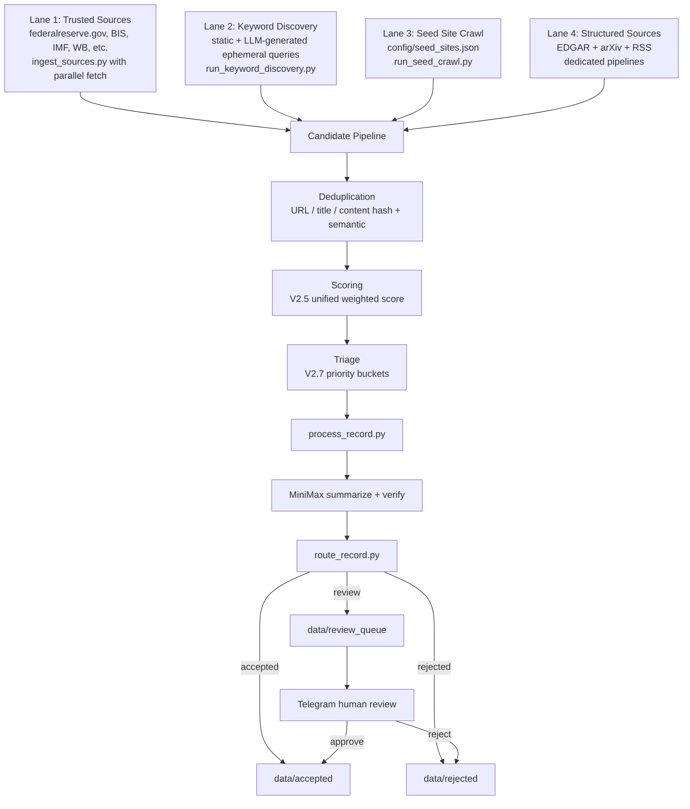

---

## 9. V2.5 Unified Scoring System

**Scripts:**
- `scripts/extract_candidate_features.py`
- `scripts/score_candidate.py`
- `scripts/score_candidates_batch.py`

### Scoring components

| Component | Weight | Description |
|-----------|--------|-------------|
| domain_trust | 0.25 | Trust from domain baselines (high=100, medium=50, low=10) |
| url_quality | 0.20 | URL structure hints (positive: press, report, research) |
| title_quality | 0.20 | Title keyword hints |
| keyword_match | 0.20 | Match against keyword bundles |
| freshness | 0.10 | Age decay (full score < 168 hours) |
| lane_reliability | 0.10 | Lane-based reliability (trusted=100, keyword=50, seed=30) |
| duplication_risk | -0.15 | Duplicate penalty (URL/title hash matches) |

### Scoring and priority flow

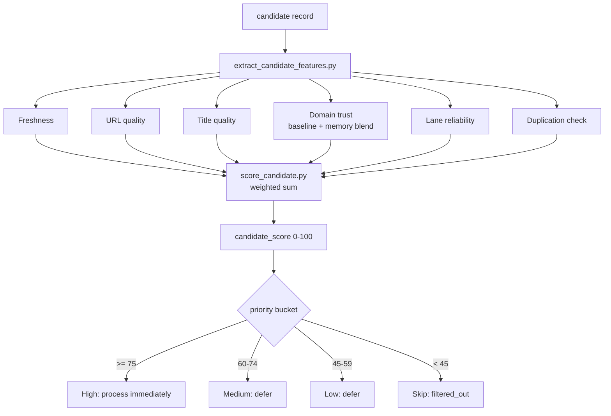

---

## 10. V2.5 Memory System

**Scripts:** `scripts/memory_persistence.py`, `scripts/memory_manager.py`, `scripts/update_source_memory.py`

| Memory Type | Tracks | Stored At |
|-------------|--------|-----------|
| Domain Memory | trust_score, accepted/rejected counts | `data/source_memory/domain_memory.json` |
| Path Memory | path-pattern trust (e.g. `/research/`) | `data/source_memory/path_memory.json` |
| Source Memory | per-source yield/noise ratios | `data/source_memory/source_memory.json` |

### Cold-start blending

New domains start at baseline trust and shift to learned trust as evidence accumulates:

| Samples | Baseline Weight | Learned Weight |
|---------|-----------------|----------------|
| 0–9 | 90–100% | 0–10% |
| 10–24 | blending | blending |
| 25+ | 10% | 90% |

Human decisions count 2× more than automatic decisions.

---

## 11. V2.7 Intelligence Layer

V2.7 adds six post-processing subsystems on top of the archive:

### Triage and Prioritization Engine

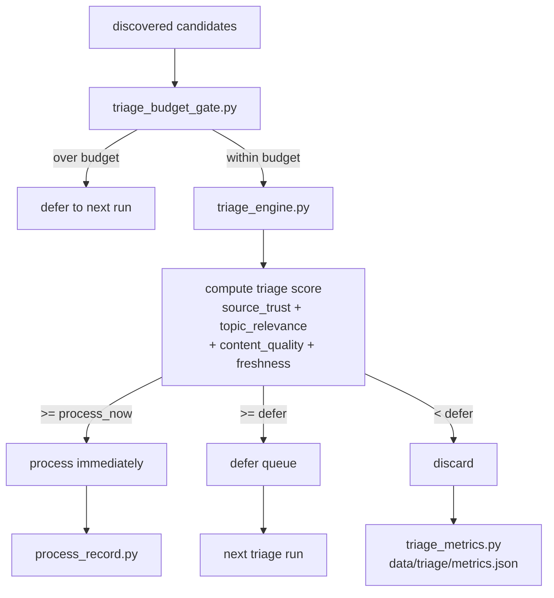

### V2.7 Complete System Overview

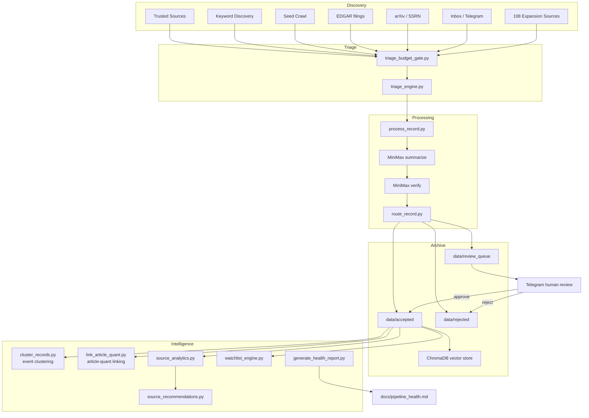

---

## 12. Article-Quant Enrichment

**Script:** `scripts/link_article_quant.py`

Deterministic config-driven linking between narrative article records and quantitative data records across four dimensions:

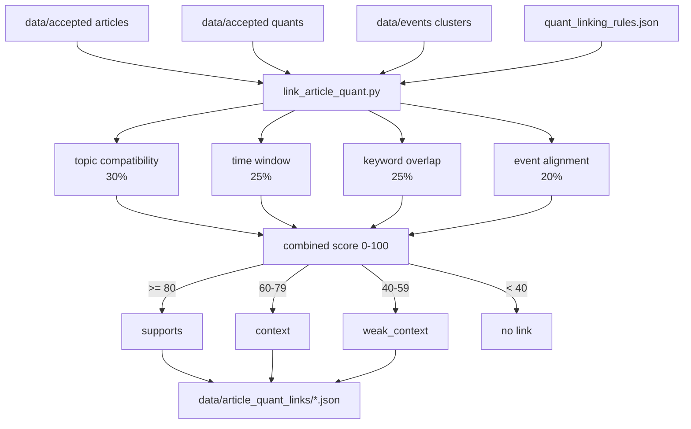

---

## 13. Source Performance Analytics

**Scripts:** `scripts/source_analytics.py`, `scripts/source_recommendations.py`

Tracks acceptance / review / rejection / filtered-out ratios per source domain and generates actionable management recommendations.

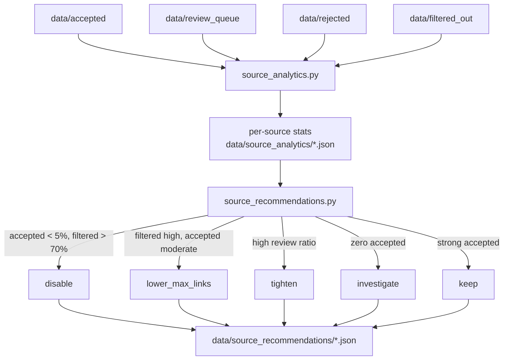

---

## 14. V3 Phase 10 — Parallel Fetch Detail

### Parallel fetch worker architecture

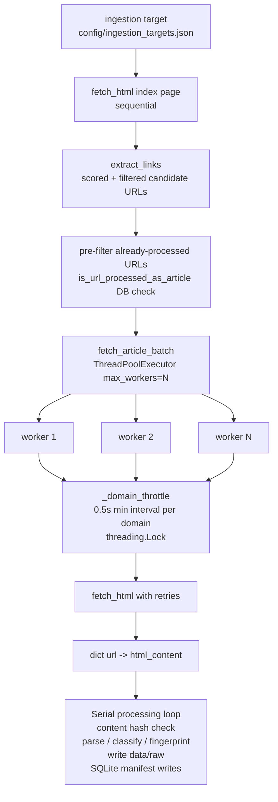

### Quant numeric change detection detail

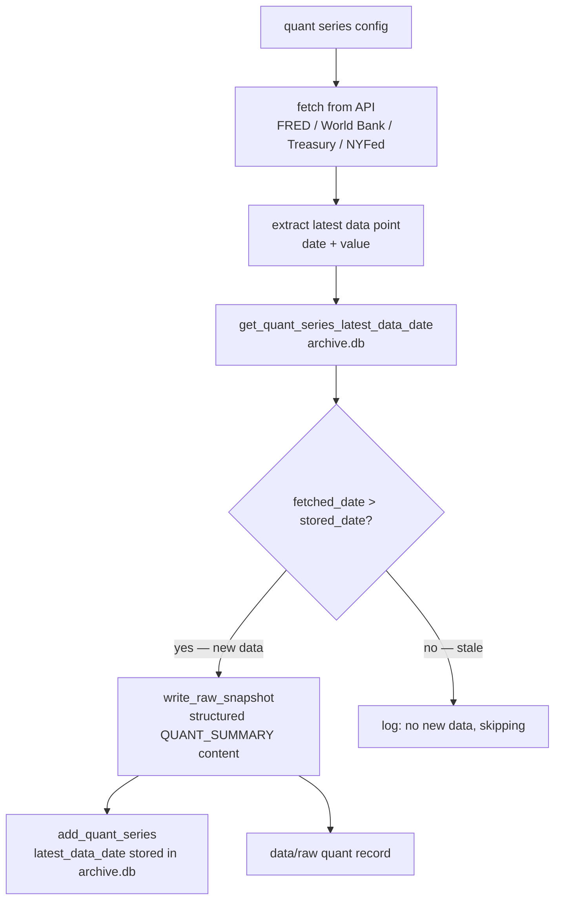

---

## GitHub Secrets reference

| Secret | Required by | How to obtain |
|--------|-------------|---------------|
| `OPENAI_API_KEY` | All MiniMax steps | MiniMax / OpenAI dashboard |
| `OPENAI_BASE_URL` | All MiniMax steps | Set to `https://api.minimax.io/v1` |
| `TELEGRAM_BOT_TOKEN` | Review send | @BotFather in Telegram |
| `TELEGRAM_CHAT_ID` | Review send | `getUpdates` API call |
| `FRED_API_KEY` | Quant pipeline | [fred.stlouisfed.org](https://fred.stlouisfed.org/docs/api/api_key.html) |
| `TAVILY_API_KEY` | Keyword discovery | [tavily.com](https://tavily.com) |
| `GITHUB_TRIGGER_TOKEN` | Finalize review callback | GitHub personal access token |
| `TELEGRAM_INGEST_BOT_TOKEN` | Phase 7 — Telegram ingestion | @BotFather in Telegram |
| `TELEGRAM_INGEST_CHAT_ID` | Phase 7 — Telegram ingestion | `getUpdates` API call |
| `BLS_API_KEY` | Phase 10 — optional BLS series | [data.bls.gov/registrationEngine](https://data.bls.gov/registrationEngine/) |
| `BEA_API_KEY` | Phase 10 — optional BEA series | [apps.bea.gov/API/signup](https://apps.bea.gov/API/signup/) |
