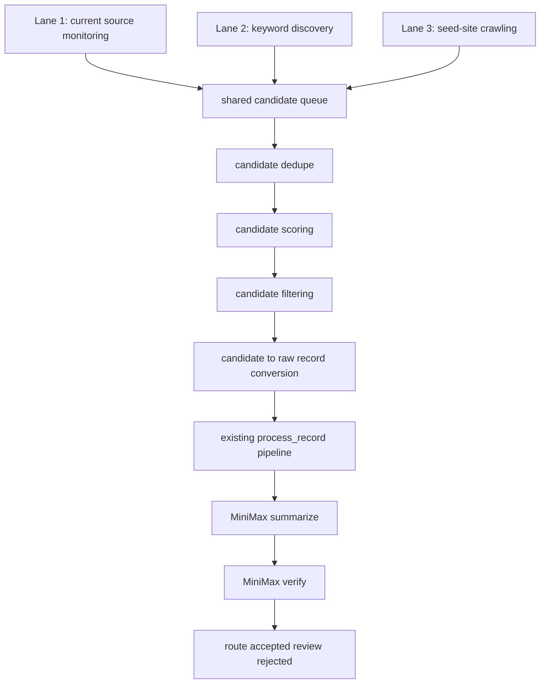

# V2 Part 1 — Shared Candidate Schema and Orchestration

## Purpose

This spec defines the shared candidate layer for V2. Every discovery lane should produce the same candidate shape before records enter the existing archive pipeline.

The goal is to make V2 additive rather than destructive:
- Lane 1 keeps monitoring trusted sources
- Lane 2 adds keyword discovery
- Lane 3 adds seed-site crawling
- all three lanes converge into one shared backend

This part covers:
- candidate schema
- folder layout
- manifests
- dedupe strategy
- scoring model
- orchestration flow
- scheduling model
- implementation plan
- acceptance criteria

---

## Why this part exists

Right now the archive is source-specific. V2 needs a unified entrypoint so that:
- trusted-source updates
- keyword-discovered URLs
- seed-crawled URLs

all look the same before filtering, summarization, and verification.

Without this, V2 becomes a mess of special-case code.

---

## Design principles

### 1. Every lane emits the same candidate shape
Each lane can discover differently, but downstream processing should not care where a candidate came from.

### 2. Discovery and evaluation are separate
Discovery finds candidates.
Evaluation decides if they are worth processing.

### 3. Dedupe happens before MiniMax
We should not waste AI calls on duplicate URLs, duplicate titles, or near-duplicate content.

### 4. Trust should be explicit
Candidates from trusted monitored sources should carry more trust than open-web discovered candidates.

### 5. Existing V1 archive logic stays reusable
Accepted, review queue, rejected, Telegram review, and finalize flow should all remain intact.

---

## High-level architecture



---

## Shared candidate schema

Create a new schema file:

`schemas/candidate_record.json`

Recommended structure:

```json
{
  "candidate_id": "string",
  "lane": "trusted_sources | keyword_discovery | seed_crawl",
  "discovered_at": "ISO-8601 timestamp",
  "topic": "macro catalysts | market structure | other",
  "source": {
    "domain": "string",
    "source_name": "string",
    "url": "string",
    "discovery_url": "string",
    "discovery_method": "monitor | search | crawl",
    "trust_tier": "high | medium | low"
  },
  "title": "string",
  "anchor_text": "string",
  "raw_html_path": "string",
  "raw_text_path": "string",
  "metadata": {
    "http_status": 200,
    "content_type": "text/html",
    "published_at": "optional ISO timestamp",
    "language": "en",
    "word_count": 0
  },
  "candidate_scores": {
    "url_score": 0,
    "anchor_score": 0,
    "domain_trust_score": 0,
    "keyword_score": 0,
    "freshness_score": 0,
    "total_score": 0
  },
  "dedupe": {
    "url_hash": "string",
    "normalized_title_hash": "string",
    "content_hash": "string"
  },
  "status": "discovered | deduped_out | filtered_out | converted_to_raw | processed",
  "notes": "string"
}
```

---

## Candidate ID strategy

Candidate IDs should be deterministic and stable enough to debug.

Format:

`<lane>_<normalized_domain>_<short_title_slug>_<short_hash>`

Examples:
- `trusted_sources_federalreserve_press_release_12ab34cd`
- `keyword_discovery_brookings_fed_repricing_98ef76aa`
- `seed_crawl_newyorkfed_repo_liquidity_44dc190b`

Rules:
- lane prefix required
- title slug truncated
- final short hash based on URL

---

## New folders for V2

Recommended additions:

```text
config/
  keyword_queries.json
  seed_sites.json

schemas/
  candidate_record.json

data/
  candidates/
    discovered/
    deduped_out/
    filtered_out/
    converted/
  candidate_manifests/
    candidate_index.json
    lane_stats.json
```

Purpose:
- `discovered/` stores raw candidate JSON records before filtering
- `deduped_out/` stores candidates eliminated before raw record creation
- `filtered_out/` stores weak candidates that failed scoring/filtering
- `converted/` stores candidates that were promoted into raw archive records

---

## New manifests

### 1. `data/candidate_manifests/candidate_index.json`
Tracks candidate IDs and dedupe fingerprints.

Suggested fields:

```json
{
  "seen_url_hashes": {},
  "seen_title_hashes": {},
  "seen_content_hashes": {},
  "candidate_map": {}
}
```

### 2. `data/candidate_manifests/lane_stats.json`
Tracks counts by lane.

Suggested fields:

```json
{
  "trusted_sources": {
    "discovered": 0,
    "deduped_out": 0,
    "filtered_out": 0,
    "converted": 0
  },
  "keyword_discovery": {
    "discovered": 0,
    "deduped_out": 0,
    "filtered_out": 0,
    "converted": 0
  },
  "seed_crawl": {
    "discovered": 0,
    "deduped_out": 0,
    "filtered_out": 0,
    "converted": 0
  }
}
```

---

## Dedupe strategy

The shared candidate layer should dedupe in this order:

### Level 1 — URL hash
If exact URL already exists, skip.

### Level 2 — normalized title hash
If same title has already been seen recently from same domain or trusted-family domain, skip.

### Level 3 — content hash
If extracted text fingerprint matches existing content, skip.

### Level 4 — similarity window
Optional later step.
Could be fuzzy match on normalized titles or first 500 words.

---

## Scoring model

Every candidate gets a score before conversion into a raw record.

### Positive signals
- domain is trusted
- URL contains press / statement / report / speech / research / analysis
- anchor text contains monetary policy / inflation / rates / liquidity / treasury / repo / labor market / GDP / PCE / volatility
- published recently
- URL path looks article-like

### Negative signals
- URL contains about / careers / experts / events / category / tag / archive / subscribe / webinar / podcast
- content is too short
- title is generic or navigation-like
- title or anchor contains non-relevant terms

### Suggested score components
- `url_score`
- `anchor_score`
- `domain_trust_score`
- `keyword_score`
- `freshness_score`

Total score formula can be simple addition at first.

---

## Trust tiers

Add domain trust tiers.

### High trust
Official and core domains:
- federalreserve.gov
- newyorkfed.org
- treasury.gov
- fiscaldata.treasury.gov
- bankofcanada.ca
- ecb.europa.eu
- bankofengland.co.uk
- sec.gov

### Medium trust
Research and institutional domains:
- bis.org
- imf.org
- brookings.edu
- piie.com
- regional Fed blogs

### Low trust
Anything discovered from broader keyword search later that is not in an allowlist.

---

## Conversion into raw archive records

Only candidates that survive:
- dedupe
- scoring
- filtering

should be converted into the current V1 raw format.

That conversion stage should:
- create `data/raw/<record_id>.txt`
- include lane info in the raw record header
- include source domain and discovery method

Suggested raw header:

```text
TARGET: Federal Reserve Press Releases
TOPIC: macro catalysts
TITLE: Example Title
URL: https://example.com/...
LANE: trusted_sources
DISCOVERY_METHOD: monitor
DOMAIN_TRUST_TIER: high
```

---

## Orchestration script

Create a new orchestration script later:

`scripts/run_v2_candidate_pipeline.py`

Responsibilities:
1. call one or more discovery lanes
2. save candidate JSON records
3. dedupe candidates
4. score/filter candidates
5. convert survivors to raw records
6. call existing `process_record.py`
7. send reviews if needed

For V2 phase-in, this can be run per lane first.

---

## Recommended file additions for Part 1

### New files
- `schemas/candidate_record.json`
- `scripts/candidate_utils.py`
- `scripts/dedupe_candidates.py`
- `scripts/score_candidates.py`
- `scripts/convert_candidates_to_raw.py`
- `config/domain_trust_tiers.json`

### `candidate_utils.py` should contain
- candidate ID builders
- hash helpers
- normalize title
- save/load JSON helpers
- lane stats update helpers

---

## Detailed implementation plan

### Step 1
Create `schemas/candidate_record.json`.

### Step 2
Create candidate folders under `data/candidates/`.

### Step 3
Create `candidate_index.json` and `lane_stats.json`.

### Step 4
Build `scripts/candidate_utils.py`.

### Step 5
Build `scripts/dedupe_candidates.py`.

### Step 6
Build `scripts/score_candidates.py`.

### Step 7
Build `scripts/convert_candidates_to_raw.py`.

### Step 8
Create a small orchestrator that runs these in sequence for a single test lane.

---

## Acceptance criteria

Part 1 is complete when:
- all lanes can write into the same candidate schema
- dedupe works across lane boundaries
- candidate scoring and filtering exist before raw conversion
- surviving candidates can be converted into current V1 raw records
- the shared backend is lane-agnostic

---

## Non-goals for Part 1

This part does not build:
- keyword discovery itself
- seed crawling itself
- new AI prompts
- fuzzy semantic dedupe

It only builds the shared foundation that those lanes need.

---

## Final outcome of Part 1

When Part 1 is complete, V2 will have a reusable candidate layer that lets any future discovery method plug into the same archive backend safely.
