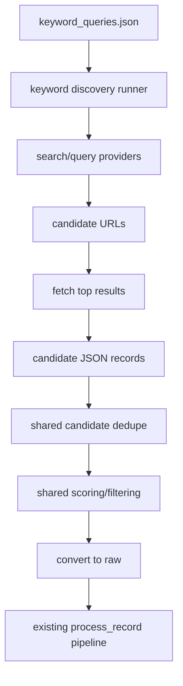

# V2 Part 2 — Keyword Discovery Lane

## Purpose

This spec defines Lane 2 of V2: scheduled keyword and topic discovery.

This lane exists to discover relevant articles and pages that are not already covered by your static source list.

It is the first exploratory lane because it is easier to control than full crawling and adds the most immediate value.

This part covers:
- query design
- query config
- candidate discovery
- result scoring
- trust handling
- lane-specific filtering
- integration into the shared candidate layer
- orchestration and acceptance criteria

---

## Why this lane exists

Trusted source monitoring is reliable, but limited.

Keyword discovery helps you catch:
- new narratives
- emerging themes
- relevant content on domains you do not yet monitor directly
- topic spikes before they are added to your source universe

Examples:
- repo stress
- liquidity tightening
- Treasury refunding impact
- inflation expectations repricing
- Fed path repricing
- ETF flow / volatility pressure

---

## Core principle

Keyword discovery should be **theme-driven**, not generic web search.

Bad example:
- finance news
- stock market

Good example:
- treasury refunding liquidity impact
- repo market stress
- inflation expectations breakevens
- funding conditions risk assets
- central bank balance sheet runoff

---

## Lane output

This lane should output shared candidate records defined in Part 1.

It should not bypass the candidate layer.

Flow:



---

## Query config

Create:

`config/keyword_queries.json`

Suggested structure:

```json
{
  "queries": [
    {
      "id": "repo_stress",
      "topic": "market structure",
      "enabled": true,
      "priority": "high",
      "query": "repo market stress liquidity treasury funding",
      "required_terms": ["repo", "liquidity"],
      "preferred_domains": [
        "newyorkfed.org",
        "federalreserve.gov",
        "treasury.gov",
        "bankofengland.co.uk",
        "ecb.europa.eu"
      ],
      "blocked_domains": [],
      "max_results": 10
    },
    {
      "id": "inflation_repricing",
      "topic": "macro catalysts",
      "enabled": true,
      "priority": "high",
      "query": "inflation repricing rates fed expectations labor market",
      "required_terms": ["inflation", "rates"],
      "preferred_domains": [
        "federalreserve.gov",
        "newyorkfed.org",
        "brookings.edu",
        "piie.com",
        "imf.org"
      ],
      "blocked_domains": [],
      "max_results": 10
    }
  ]
}
```

---

## Search providers

Start simple.

Possible provider options later:
- search APIs
- RSS search/discovery
- site-restricted searches
- custom news APIs

For the first implementation, build the lane so providers are pluggable.

Create a provider interface in:

`scripts/discovery_providers.py`

Suggested functions:
- `search_web(query: str) -> list[dict]`
- `search_news(query: str) -> list[dict]`
- `search_preferred_domains(query: str, domains: list[str]) -> list[dict]`

The result format should be normalized before candidate creation.

---

## Result normalization

Every raw search result should be normalized into this shape before candidate creation:

```json
{
  "title": "string",
  "url": "string",
  "snippet": "string",
  "source_domain": "string",
  "provider": "string",
  "published_at": "optional ISO timestamp"
}
```

---

## Candidate generation rules

For each normalized result:

1. validate URL
2. apply domain allow/block logic
3. apply required-term logic
4. fetch page
5. extract article text
6. emit candidate record into the shared candidate folder

---

## Required-term logic

Each query can specify `required_terms`.

Example:
- query: `repo market stress liquidity treasury funding`
- required terms: `repo`, `liquidity`

A result should be discarded early if neither the title/snippet nor fetched text contains the required terms.

This cuts junk before MiniMax.

---

## Preferred domain logic

Preferred domains should not be the same as allow-only domains.

Use them as positive scoring signals, not hard requirements.

Examples:
- result on `newyorkfed.org` gets boosted
- result on random site gets lower trust and lower score

This keeps the lane exploratory without going full chaos.

---

## Blocked domain logic

Some domains should be blocked fully if they become junk-heavy.

Create:

`config/keyword_blocked_domains.json`

Suggested format:

```json
{
  "domains": [
    "pinterest.com",
    "facebook.com",
    "instagram.com",
    "youtube.com"
  ]
}
```

This can be extended later.

---

## Candidate scoring for this lane

Keyword discovery candidates should be scored more aggressively than trusted-source candidates.

Suggested extra scoring factors:

### Positive
- preferred domain
- title contains query terms
- snippet contains query terms
- content contains required terms
- published recently

### Negative
- low trust domain
- generic title
- page is a category page
- URL contains event/archive/about strings

---

## Lane-specific trust policy

By default:
- preferred/official domains discovered by keyword search -> medium to high trust
- unknown but legitimate institutional domain -> medium trust
- unknown generic media/blog domain -> low trust

Low-trust discovered content should more often route to review, not auto-accept.

---

## Suggested scripts

### New files
- `config/keyword_queries.json`
- `config/keyword_blocked_domains.json`
- `scripts/run_keyword_discovery.py`
- `scripts/discovery_providers.py`
- `scripts/normalize_search_results.py`
- `scripts/build_keyword_candidates.py`

### `run_keyword_discovery.py` responsibilities
1. load keyword query config
2. execute enabled queries
3. gather normalized results
4. fetch selected result pages
5. create candidate JSON records using shared schema
6. call shared candidate dedupe/filter/convert steps
7. pass survivors into `process_record.py`

---

## Folder interactions

This lane should write to:
- `data/candidates/discovered/`
- `data/candidates/deduped_out/`
- `data/candidates/filtered_out/`
- `data/candidates/converted/`

It should then convert accepted candidates into:
- `data/raw/`

and reuse existing archive processing.

---

## Sample orchestration flow

```text
run_keyword_discovery.py
-> load keyword_queries.json
-> for each enabled query
   -> call provider
   -> normalize results
   -> filter by blocked domains / required terms
   -> fetch page content
   -> build candidate records
-> shared dedupe
-> shared scoring
-> shared filtering
-> convert survivors to raw records
-> process_record.py for each converted record
-> send pending reviews
```

---

## Quality controls

To keep this lane useful:
- limit results per query
- enforce required terms
- boost preferred domains
- store lane stats by query ID
- track which queries generate too much junk

Add a per-query stats file later:

`data/candidate_manifests/keyword_query_stats.json`

Suggested metrics:
- discovered count
- deduped count
- filtered count
- converted count
- accepted count
- review count
- rejected count

That helps decide which queries are worth keeping.

---

## Acceptance criteria

Part 2 is complete when:
- keyword queries are configurable via JSON
- the lane can discover URLs from topic-based queries
- candidates are normalized into the shared candidate schema
- bad domains/results are blocked early
- candidates go through shared dedupe/filter/convert flow
- survivors enter the existing archive pipeline

---

## Non-goals for Part 2

This part does not build:
- seed crawling
- full-web autonomous source addition
- domain memory or permanent source promotion

It only builds the keyword-discovery lane.

---

## Final outcome of Part 2

When complete, this lane will let the archive discover relevant content that the static source list missed, without abandoning the quality controls you already built.
